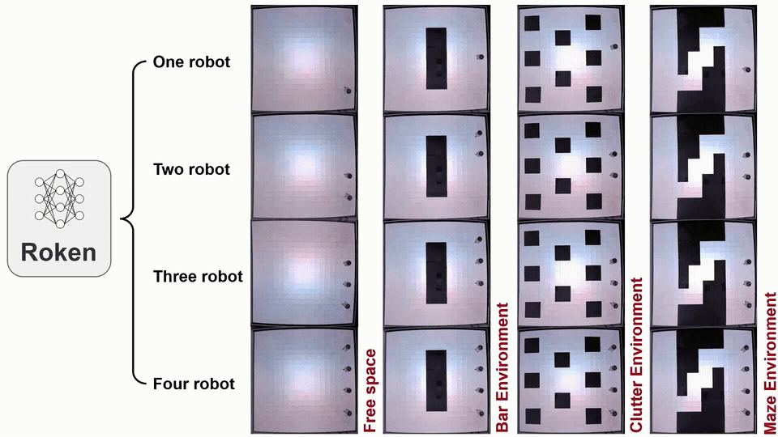
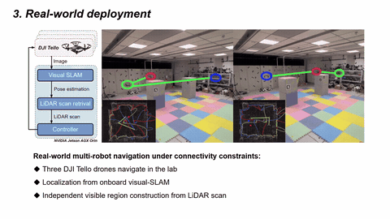
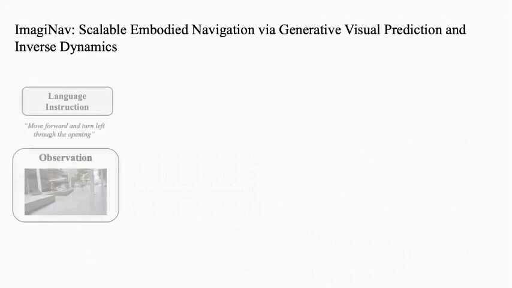
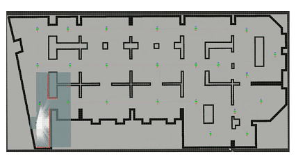
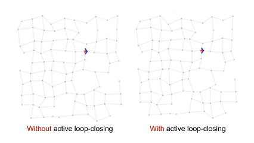
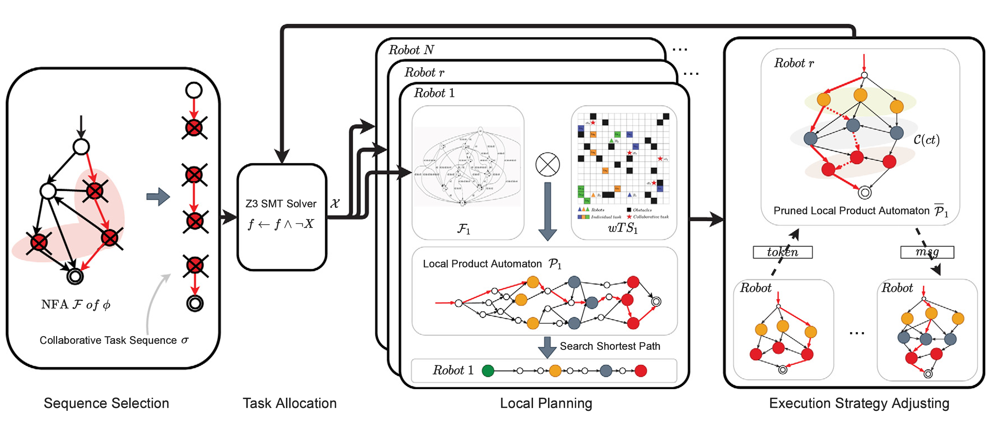
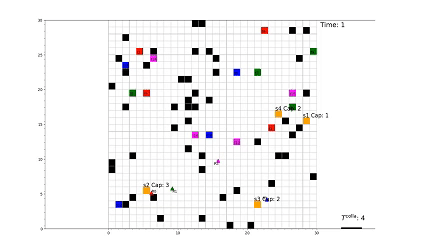

I am currently a fourth-year Ph.D. candidate at Nanyang Technological University (NTU), supervised by [Prof. Lihua Xie](https://scholar.google.com.sg/citations?user=Fmrv3J8AAAAJ&hl=en) from NTU and co-supervised by [Dr. Yau Wei-Yun](https://scholar.google.com.sg/citations?user=B_VchHYAAAAJ&hl=en) from Agency for Science, Technology and Research (A*STAR), Singapore. Before that, I received both my M. Eng. degree (2022) and B. Eng. degree (2019) from Zhejiang University (ZJU), under the supervision of [Assoc. Prof. Ronghao Zheng](https://scholar.google.com/citations?user=LxgdmqYAAAAJ&hl=en).

<!-- I am passinate about developing intelligent robot systems that understand, reason, and act in 3D real word, with consistent spatial awareness, long-term temporal memory, and angile mobility.
I believe physical intelligence is the next step that grounding and extending the capability and existance of emergant language and visual foundation models, for a better life. -->

I am passionate about developing intelligent robotic systems that can understand, reason about, and act in the 3D real world, with consistent spatial awareness, long-term memory, and agile mobility. I believe physical intelligence is a crucial next step toward grounding and extending the capabilities of emerging language and vision foundation models, ultimately benefiting everyday life.

My research has primarily focused on robot planning and coordination using generative models, reinforcement learning, optimization, graph theory, and symbolic/formal methods. My research topics include active localization and mapping, planning under complex spatiotemporal constraints, and autonomous exploration, with an emphasis on real-world applications. More exciting research lies ahead. Feel free to reach out for discussions or collaborations!

Selected News
======
* [09/2026] Two paper got accepted by CoRL 2026! The first attempt to introduce a distribution learning paradigm into multi-robot coordination by robot tokenization!
* [06/2026] Three paper got accepted by IEEE/RSJ IROS 2026! The acceptance rate drops to 36% this year. Congrats to Junhe Sheng, Jie Chen, and Yuteng Sun!
* [05/2025] My first-authored paper about line-of-sight maintenance was selected as the ICRA 2025 Best Conference Paper Award Finalist.
* [05/2025] I presented two papers about SLAM-aware exploration and line-of-sight maintenance at IEEE ICRA 2025 at Atlanta, USA.
* [01/2025] Three papers got accepted by IEEE ICRA 2025!
* [07/2024] One paper got accepted by IEEE/RSJ IROS 2024!
* [06/2024] One paper got accepted by IEEE RA-L!

Selected Projects
======

    
    

        <strong class="selected-project__title">Robots as Tokens: Unified Diffusion Transformer for Coordinated Multi-Robot Trajectory Generation</strong>
         
        <em><b>Ruofei Bai</b>, J Chen, Y Cai, J Li, WY Yau, L Xie</em>
         
        Accepted by CoRL 2026. [<a href="https://arxiv.org/abs/2606.15550">Paper</a>] [<a href="https://bairuofei.github.io/roken-project-page/">Project</a>]
    

    
    

        <strong class="selected-project__title">Line-of-Sight-Constrained Multi-Robot Mapless Navigation via Polygonal Visible Regions</strong>
         
        <em><b>Ruofei Bai</b>, S Yuan, X Xu, X Ji, X Li, H Guo, WY Yau, L Xie</em>
         
        Submitted to RA-L. [<a href="https://arxiv.org/abs/2603.26314">Paper</a>] [<a href="https://github.com/bairuofei/LoS_constrained_navigation">Code</a>]
    

    
    

        <strong class="selected-project__title">Beyond Imitation: Reinforcement Learning Fine-Tuning for Adaptive Diffusion Navigation Policies</strong>
         
        <em>J Sheng*, <b>Ruofei Bai*</b>, K Xu, R Liu, J Chen, S Yuan, WY Yau, L Xie</em>
         
        2026 IEEE/RSJ International Conference on Intelligent Robots and Systems (IROS). [<a href="https://arxiv.org/abs/2603.12868">Paper</a>]
    

    
    

        <strong class="selected-project__title">TIDAL: Temporally Interleaved Diffusion and Action Loop for High-Frequency VLA Control</strong>
         
        <em>Y Sun, H Wang, <b>Ruofei Bai</b>, Z Li, J Li, M Yee, WY Yau</em>
         
        2026 IEEE/RSJ International Conference on Intelligent Robots and Systems (IROS). [<a href="https://arxiv.org/abs/2601.14945">Paper</a>]
    

    
    

        <strong class="selected-project__title">ImagiNav: Scalable Embodied Navigation via Generative Visual Prediction and Inverse Dynamics</strong>
         
        <em>J Chen, Y Cai, Y Wang, <b>Ruofei Bai</b>, Y Cao, J Li, YW Yun, G Sartoretti</em>
         
        2026 IEEE/RSJ International Conference on Intelligent Robots and Systems (IROS). [<a href="https://arxiv.org/abs/2603.13833">Paper</a>]
    

    
    

        <strong class="selected-project__title">Realm: Real-Time Line-of-Sight Maintenance in Multi-Robot Navigation with Unknown Obstacles</strong>
         
        <em><b>Ruofei Bai</b>, S Yuan, K Li, H Guo, WY Yau, L Xie</em>
         
        2025 IEEE International Conference on Robotics and Automation (ICRA). [<a href="https://arxiv.org/abs/2502.15162">Paper</a>] [<a href="https://github.com/bairuofei/LoS_constrained_navigation">Code</a>]
         
        Best Paper Award Finalist
    

    
    

        <strong class="selected-project__title">Graph-based Slam-Aware Exploration with Prior Topo-Metric Information</strong>
         
        <em><b>Ruofei Bai</b>, H Guo, WY Yau, L Xie</em>
         
        IEEE Robotics and Automation Letters (RA-L), 2024. [<a href="https://arxiv.org/abs/2308.16522">Paper</a>] [<a href="https://github.com/bairuofei/Graph-Based_SLAM-Aware_Exploration">Code</a>]
    

    
    

        <strong class="selected-project__title">Multi-Robot Active Graph Exploration with Reduced Pose-SLAM Uncertainty via Submodular Optimization</strong>
         
        <em><b>Ruofei Bai</b>, S Yuan, H Guo, P Yin, WY Yau, L Xie</em>
         
        2024 IEEE/RSJ International Conference on Intelligent Robots and Systems (IROS). [<a href="https://arxiv.org/abs/2407.01013">Paper</a>] [<a href="https://github.com/bairuofei/CGE">Code</a>]
    

    
    

        <strong class="selected-project__title">Hierarchical Multi-Robot Strategies Synthesis and Optimization under Individual and Collaborative Temporal Logic Specifications</strong>
         
        <em><b>Ruofei Bai</b>, R Zheng, M Liu, S Zhang</em>
         
        Robotics and Autonomous Systems (RAS), 2022. [<a href="https://arxiv.org/abs/2110.11162">Paper</a>]
    

    
    

        <strong class="selected-project__title">Multi-Robot Task Planning under Individual and Collaborative Temporal Logic Specifications</strong>
         
        <em><b>Ruofei Bai</b>, R Zheng, M Liu, S Zhang</em>
         
        2021 IEEE/RSJ International Conference on Intelligent Robots and Systems (IROS). [<a href="https://arxiv.org/abs/2108.11597">Paper</a>] [<a href="https://github.com/bairuofei/sampling_ltl_planning">Code</a>]
    

