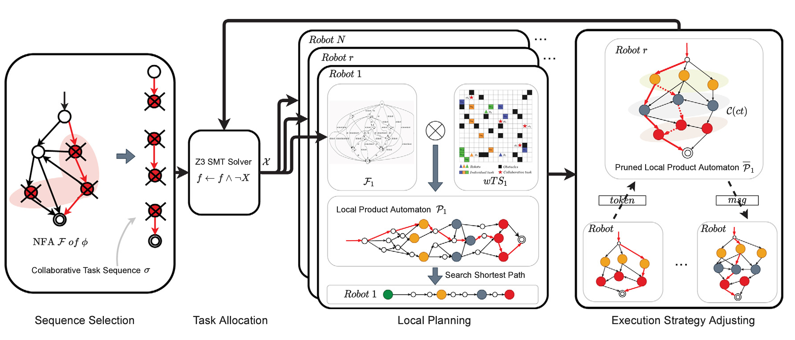

I am currently a third-year Ph.D. candidate at Nanyang Technological University (NTU), supervised by [Prof. Lihua Xie](https://scholar.google.com.sg/citations?user=Fmrv3J8AAAAJ&hl=en) from NTU and co-supervised by [Dr. Yau Wei-Yun](https://scholar.google.com.sg/citations?user=B_VchHYAAAAJ&hl=en) from Agency for Science, Technology and Research (A*STAR), Singapore. Before that, I received both my M. Eng. degree (2022) and B. Eng. degree (2019) from Zhejiang University (ZJU), under the supervision of [Prof. Ronghao Zheng](https://scholar.google.com/citations?user=LxgdmqYAAAAJ&hl=en).

My research primarily focuses on **planning and optimization problems** in multi-robot systems, including autonomous exploration, active SLAM, and planning under practical communication and temporal constraints. I am passionate about **uncovering the mathematical foundations underlying practical challenges** in autonomous robotic systems for real-world deployment, utilizing tools from optimization, graph theory, etc. I am also actively seeking the combination of robotics and learning-based foundation models. Feel free to reach out if you're interested in my work!

Selected News
======
* [05/2025] My first-authored paper about line-of-sight maintenance was selected as the ICRA 2025 Best Conference Paper Award Finalist.
* [05/2025] I presented two papers about SLAM-aware exploration and line-of-sight maintenance at IEEE ICRA 2025 at Atlanta, USA.
* [01/2025] Three papers got accepted by IEEE ICRA 2025!
* [07/2024] One paper got accepted by IEEE/RSJ IROS 2024!
* [06/2024] One paper got accepted by IEEE RA-L!

Selected Publications
======

    
    

        <strong><a href="https://arxiv.org/abs/2502.15162">Realm: Real-Time Line-of-Sight Maintenance in Multi-Robot Navigation with Unknown Obstacles</a></strong>  
         
        <em><b>Ruofei Bai</b>, Shenghai Yuan, Kun Li, Hongliang Guo, Wei-Yun Yau, Lihua Xie</em>  
         
        2025 IEEE International Conference on Robotics and Automation (ICRA) Best Paper Award Finalist
    

    
    

        <strong><a href="https://arxiv.org/abs/2308.16522">Graph-based Slam-Aware Exploration with Prior Topo-Metric Information</a></strong>  
         
        <em><b>Ruofei Bai</b>, Hongliang Guo, Wei-Yun Yau, Lihua Xie</em>  
         
        IEEE Robotics and Automation Letters (RA-L), 2024
    

    
    

        <strong><a href="https://arxiv.org/abs/2407.01013">Multi-Robot Active Graph Exploration with Reduced Pose-SLAM Uncertainty via Submodular Optimization</a></strong>  
         
        <em><b>Ruofei Bai</b>, Shenghai Yuan, Hongliang Guo, Pengyu Yin, Wei-Yun Yau, Lihua Xie</em>  
         
        2024 IEEE/RSJ International Conference on Intelligent Robots and Systems (IROS)
    

    
    

        <strong><a href="https://arxiv.org/abs/2110.11162">Hierarchical Multi-Robot Strategies Synthesis and Optimization under Individual and Collaborative Temporal Logic Specifications</a></strong>  
         
        <em><b>Ruofei Bai</b>, Ronghao Zheng, Meiqin Liu, Senlin Zhang</em>  
         
        Robotics and Autonomous Systems (RAS), 2022
    

    
    

        <strong><a href="https://arxiv.org/abs/2108.11597">Multi-Robot Task Planning under Individual and Collaborative Temporal Logic Specifications</a></strong>  
         
        <em><b>Ruofei Bai</b>, Ronghao Zheng, Meiqin Liu, Senlin Zhang</em>  
         
        2021 IEEE/RSJ International Conference on Intelligent Robots and Systems (IROS)
    

